# Отчёт по лабораторной работе №1 по дисциплине «Облачные технологии»

## Введение

Наша команда выполняла лабораторную работу, главной целью которой была настройка веб-сервера Nginx для обслуживания двух локальных сайтов по защищенному протоколу HTTPS. Основные задачи, которые нам нужно было решить:

1. Организовать работу сайтов по HTTPS с использованием самоподписанных сертификатов.
2. Принудительно редиректить HTTP на HTTPS.
3. Освоить использование директивы alias для раздачи файлов из каталогов, находящихся вне корневой директории сайта.
4. Завести два виртуальных хоста на одном сервере.
5. Решить возникшие в процессе проблемы.

В качестве пет проектов мы использовали два простых сайта: **minions.local** и **smeshariki.local**. Все работы проводились в локальном окружении на операционной системе Ubuntu 24.04.

## Подготовка окружения

### Настройка локальных доменных имен

Чтобы операционная система могла находить наши домены, мы добавили в `/etc/hosts`:

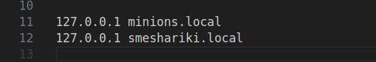

<!-- ```text
127.0.0.1   minions.local
127.0.0.1   smeshariki.local
``` -->

После сохранения изменений мы проверили правильность настройки с помощью команды `ping`. Все супер, запросы отправлялись на адрес 127.0.0.1.

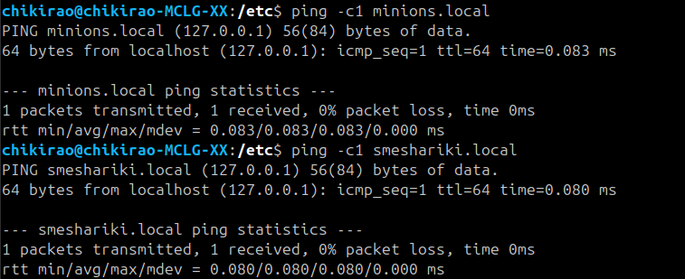

### Создание структуры каталогов и контента

Для каждого проекта были подготовлены директории с публичным содержимым и дополнительными материалами:

* `/var/www/minions/public` и `/var/www/minions/assets` — корень сайта и каталог с изображениями;
* `/var/www/smeshariki/public` и `/var/www/smeshariki/docs` — корень сайта и каталог для документов.

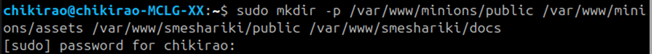

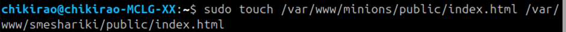

В каталогах `public` размещены простые файлы `index.html` с текстом приветствия. Каждый HTML‑файл содержит объявление кодировки UTF‑8, чтобы корректно отображать кириллицу:

```html
<!DOCTYPE html>
<html lang="ru">
<head>
    <meta charset="UTF‑8">
    <title>Minions</title>
</head>
<body>
    <h1>Я файл minions</h1>
</body>
</html>
```

Для smeshariki — аналогичная разметка, изменяется только текст.

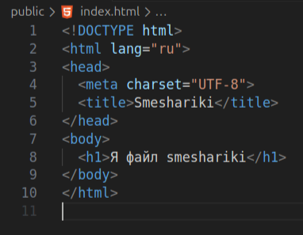

В каталог `assets` был помещён внешний файл изображения, а в `docs` — файл `readme.txt` с кириллическим содержимым, чтобы проверить работу алиасов и кодировок.

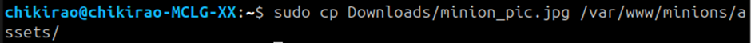

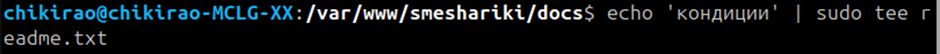

### Генерация самоподписанных сертификатов

Поскольку сайты разворачиваются только на локальной машине, получать сертификат у реального цент­ра сертификации не имеет смысла. Вместо этого были созданы **самоподписанные сертификаты** по одному на каждый домен. Для генерации использован `openssl`:

```bash
sudo openssl req -x509 -nodes -newkey rsa:2048 -days 365 \ 
  -keyout /etc/ssl/private/minions.local.key \ 
  -out /etc/ssl/certs/minions.local.crt \ 
  -subj "/CN=minions.local" \ 
  -addext "subjectAltName=DNS:minions.local"

sudo openssl req -x509 -nodes -newkey rsa:2048 -days 365 \ 
  -keyout /etc/ssl/private/smeshariki.local.key \ 
  -out /etc/ssl/certs/smeshariki.local.crt \ 
  -subj "/CN=smeshariki.local" \ 
  -addext "subjectAltName=DNS:smeshariki.local"
```

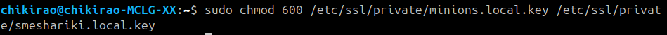

## Конфигурация Nginx

### Перенаправление HTTP на HTTPS

Для обеспечения безопасности все обращения по незащищённому протоколу (порт 80) были перенаправлены на HTTPS (порт 443). Для этого создан отдельный конфигурационный файл `/etc/nginx/conf.d/redirect.conf` с одним блоком `server`:

```nginx
server {
    listen 127.0.0.1:80;
    server_name minions.local smeshariki.local;

    return 301 https://$host$request_uri;
}
```


### Виртуальные хосты

Для каждого проекта создан отдельный конфигурационный файл с описанием виртуального хоста. Блок `server` выбирается по совпадению значения директивы `server_name` с запрошенным доменом.

#### `minions.local` — `/etc/nginx/sites-available/minions.local`

```nginx
server {
    listen 127.0.0.1:443 ssl http2;
    server_name minions.local;

    ssl_certificate     /etc/ssl/certs/minions.local.crt;
    ssl_certificate_key /etc/ssl/private/minions.local.key;
    ssl_protocols       TLSv1.2 TLSv1.3;

    root  /var/www/minions/public;
    index index.html;

    # Алиас для каталога assets
    location ^~ /assets/ {
        alias /var/www/minions/assets/;
        autoindex off;
    }

    location / {
        try_files $uri $uri/ =404;
    }
}
```

`listen 127.0.0.1:443 ssl http2;` заставляет Nginx принимать HTTPS‑запросы только на локальном интерфейсе. Директивы `ssl_certificate` и `ssl_certificate_key` указывают путь к ранее сгенерированным сертификатам. Базовый корень сайта (`root`) указывает на каталог `public`; всё, что не подпадает под специальные `location`, раздаётся из него. Часть `/assets/` заменяется на физический путь `/var/www/minions/assets/` с помощью директивы `alias`. Внутри блока `/` директива `try_files` пытается отдать запрошенный файл, затем каталог, иначе возвращает ошибку 404.

#### `smeshariki.local` — `/etc/nginx/sites-available/smeshariki.local`

```nginx
server {
    listen 127.0.0.1:443 ssl http2;
    server_name smeshariki.local;

    ssl_certificate     /etc/ssl/certs/smeshariki.local.crt;
    ssl_certificate_key /etc/ssl/private/smeshariki.local.key;
    ssl_protocols       TLSv1.2 TLSv1.3;

    root  /var/www/smeshariki/public;
    index index.html;

    # Алиас для каталога docs
    location ^~ /docs/ {
        alias /var/www/smeshariki/docs/;
        autoindex on;  # включён листинг для наглядности
    }

    location / {
        try_files $uri $uri/ =404;
    }
}
```

Здесь алиас используется для отображения содержимого каталога `docs`. Для удобства в лабораторной работе включён список файлов (`autoindex on`), чтобы можно было увидеть, какие файлы доступны по URL `https://smeshariki.local/docs/`.

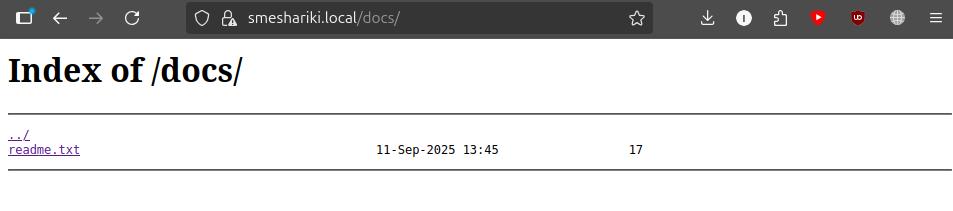

#### `redirect.conf`

```nginx
server {
   listen 127.0.0.1:80;
   # listen [::1]:80;
   server_name minions.local smeshariki.local;


   return 301 https://$host$request_uri;
}
```

### Устранение ошибок

Работая с Nginx, возникли две нетривиальные проблемы:

* **IPv6**. При первоначальной настройке блоки `listen [::1]:443 ssl http2;` приводили к ошибке «Cannot assign requested address», так как IPv6‑петля не была настроена. Исправлением стало отключение IPv6‑строк и оставление только `127.0.0.1`.

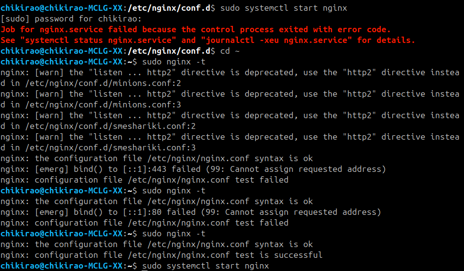

* **Кодировка текстовых файлов**. При обращении к файлу `readme.txt` из каталога `/docs/` браузер отображал набор непонятных символов.

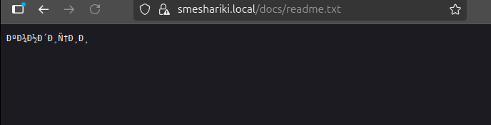

Проблема решилась добавлением двух директив в каждый серверный блок:

  ```nginx
  charset utf‑8;
  charset_types *;
  ```

  Первая директива объявляет кодировку по умолчанию, а вторая применяет её ко всем типам контента. После перезагрузки конфигурации текст успешно отображается (рисунок 4).

## Запуск

* Проверка синтаксиса: `sudo nginx -t`
* Применение конфигов: `sudo systemctl reload nginx`
  После фиксов всё зелёное и без ворнингов — перезагрузка проходит успешно.

## Тестирование

При первом обращении к сайту по HTTPS браузер предупреждает о потенциальной угрозе. Можно было решить это либо созданием локального сервера сертификации, либо подписанием наших страниц в популярных сертификаторах, например let’s encrypt, но так как наши страницы локальны, невозможно пройти проверку, поэтому самоподписаных сертификатов будет достаточно. Подтверждаем риск — видим наш контент.

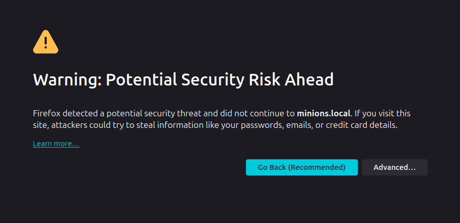

* **Редирект:** `http://minions.local` и `http://smeshariki.local` > 301 > `https://…`.

* **minions.local:** открывается `index.html`, а по `https://minions.local/assets/...` раздаются картинки и прочие статики из `assets` (через `alias`).

minions.local

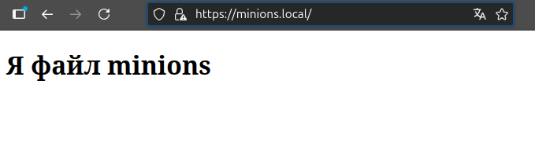

minions.local/assets/minion_pic.jpg

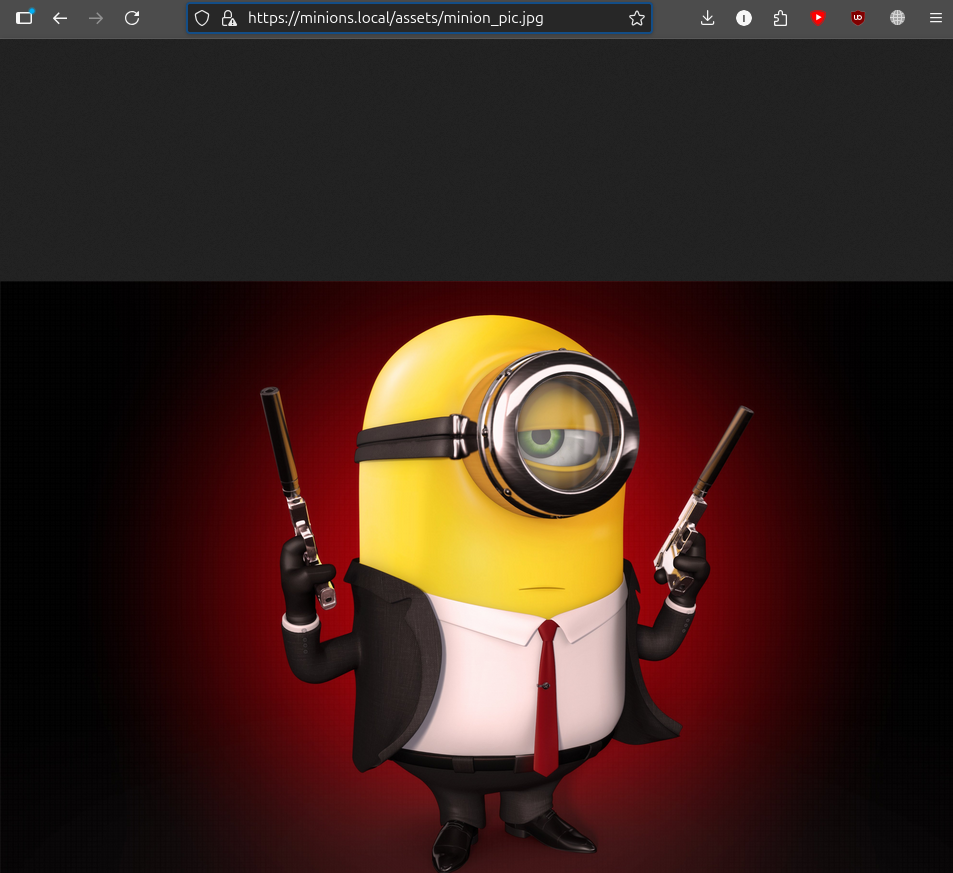

* **smeshariki.local:** корневая страница отдается из `public`, `https://smeshariki.local/docs/` показывает список файлов (специально включили `autoindex`).
  Открытие `readme.txt` после фикса `charset` отображает нормальные русские буквы.

smeshariki.local

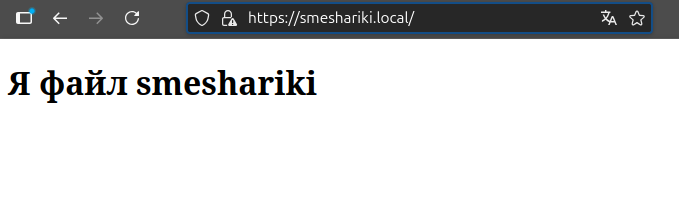

smeshariki.local/docs


smeshariki.local/docs/readme.txt

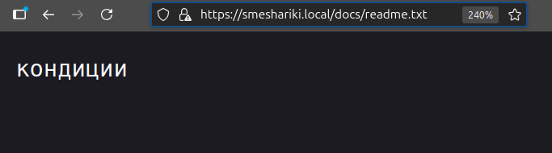

## Выводы

В ходе лабораторной работы были последовательно выполнены все пункты технического задания:

1. **Работа по HTTPS.** Для каждого домена созданы самоподписанные сертификаты; сервер настроен на приём соединений только по 443 порту с TLS 1.2/1.3.
2. **Принудительный редирект HTTP → HTTPS.** Отдельный конфигурационный блок перенаправляет любые обращения по HTTP на защищённый протокол.
3. **Использование alias.** Виртуальный хост `minions.local` раздаёт статические файлы из каталога `assets`, а `smeshariki.local` предоставляет доступ к документам в каталоге `docs` через алиас.
4. **Виртуальные хосты.** Nginx настроен обслуживать два независимых доменных имени на одном сервере с помощью директивы `server_name`.
5. **Дополнительные требования проекта.** Исправлены проблемы с IPv6, обеспечена корректная кодировка для текстовых файлов и показан пример листинга каталога.

Работа позволила закрепить навыки настройки Nginx, понимание разницы между `root` и `alias`, генерацию и подключение сертификатов, а также отладку конфигурации.