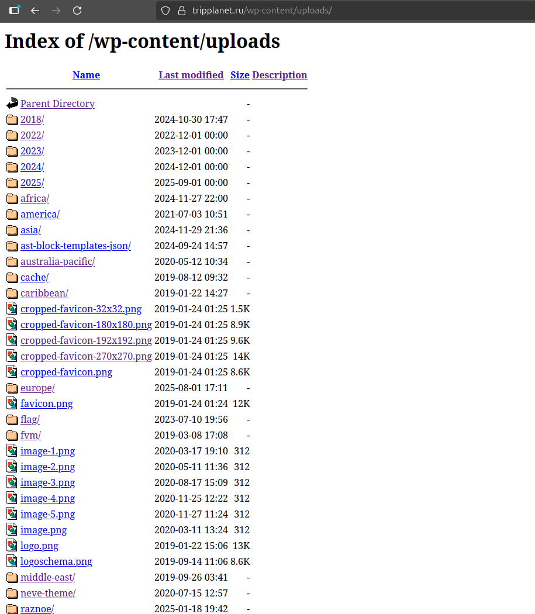
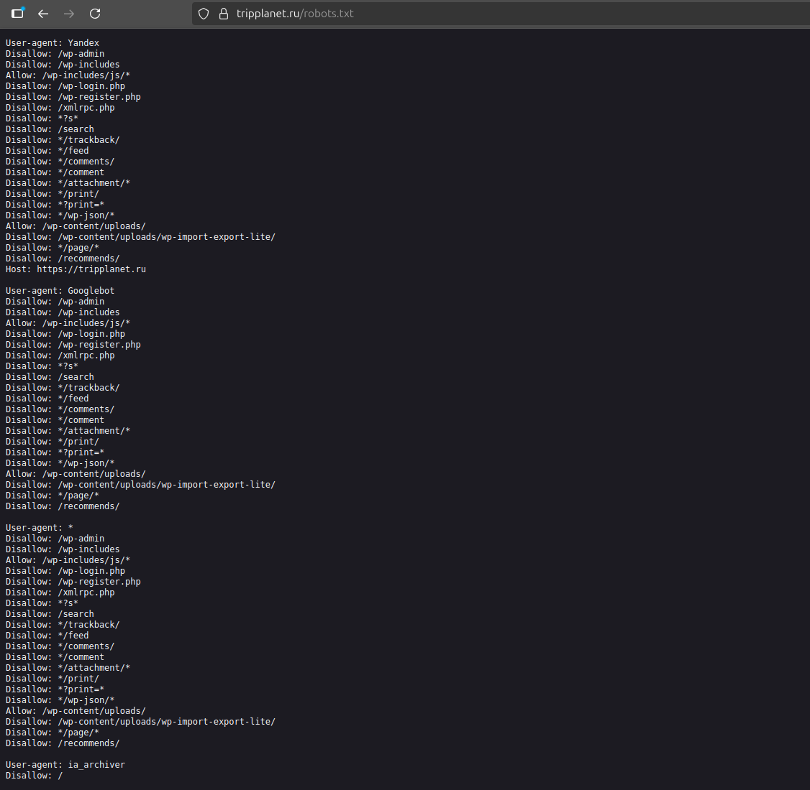
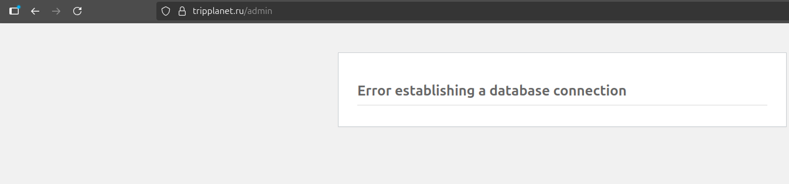
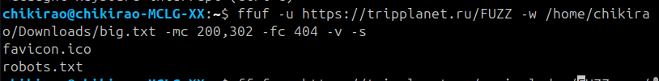
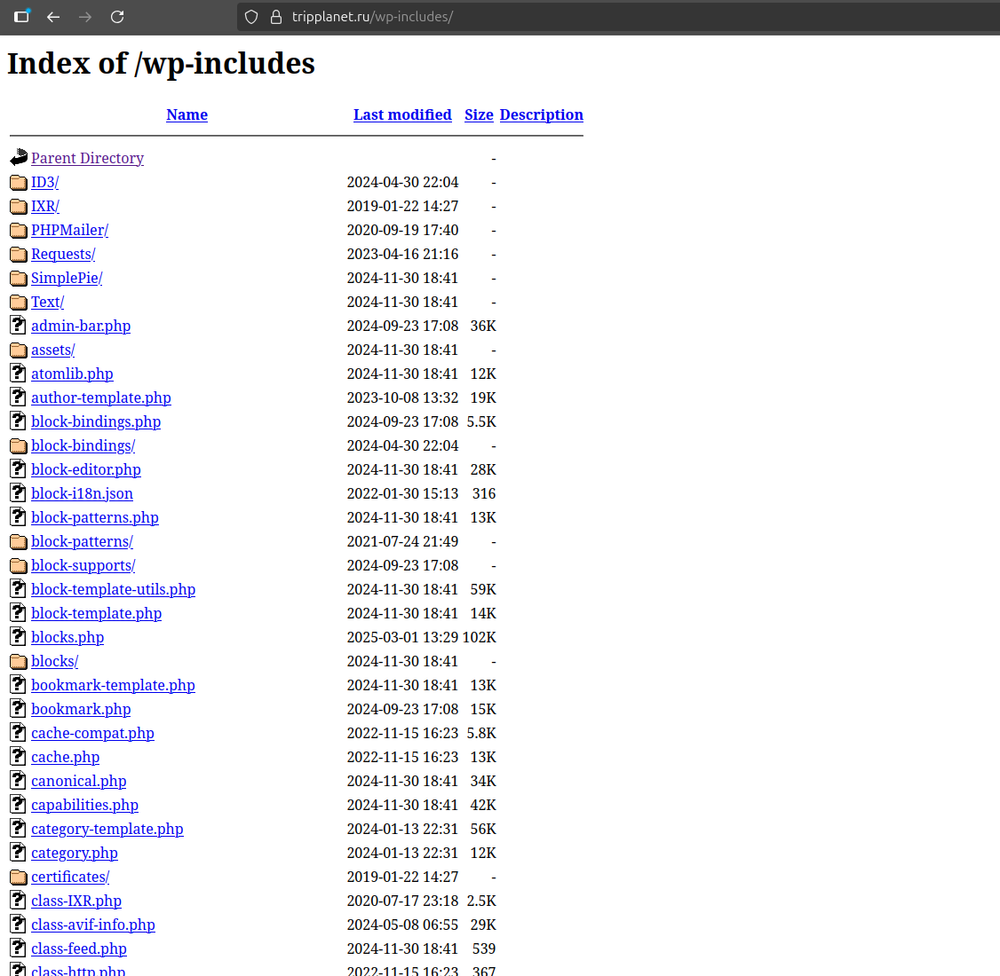
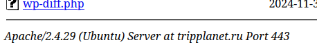

# Лабораторная работа: Поиск уязвимостей Nginx

Начали мы с того, что пошли искать локальные сайты приморского района. В какой-то момент индексированный поиск предложил этот сайт. Отличался от прошлых он тем, что на нём удалось найти интересную директорию, а именно [https://tripplanet.ru/wp-content/uploads/](https://tripplanet.ru/wp-content/uploads/):

в которой хранятся все медиа‑файлы и некоторые стили.

Этого не достаточно для взлома, но указывает на то, что разработчиком могли быть оставлены другие директории с чем‑то поинтереснее. Первым делом проверили страницу `robots.txt`, который показывает поисковикам какие страницы индексировать не надо, – там могло быть спрятано что‑то интересное.

Многие из страниц были недоступны.

Поиск с ffuf с помощью файла одного бородатого дяди (подсмотрели) особо не удивил:

И sqlmap каких‑то результатов не дал. Но была найдена ещё одна более интересная директория [https://tripplanet.ru/wp-includes/](https://tripplanet.ru/wp-includes/):

Но многие файлы тоже недоступны.

Внизу можем увидеть, что сервер на **Apache**, и по версии можно поискать актуальные уязвимости.

Проверку ffuf и sqlmap делал лёгкую, чтобы не ронять сервер.

## Заключение

В рамках работы было проверено несколько типовых направлений атаки:

* **Path traversal и открытые директории.** Мы нашли общедоступные каталоги `/wp-content/uploads/` и `/wp‑includes/`. Такие директории позволяют просматривать медиа‑файлы и библиотечные скрипты, что само по себе не даёт доступа к конфиденциальным данным, но говорит о неточностях конфигурации.
* **Перебор скрытых страниц (ffuf).** С помощью ffuf попытались перебрать пути на сайте. Подключали различные словари, однако ничего интересного не обнаружили.
* **SQL‑инъекции (sqlmap).** Запускали sqlmap против нескольких страниц в поиске SQL‑инъекции, но инструмент не нашёл уязвимостей.

Таким образом, уязвимости, позволяющей попасть в закрытую часть сайта, обнаружить не удалось. Открытые каталоги и robots.txt указывают на потенциальные слабые места в конфигурации, которые могут облегчить атаку при наличии дополнительных ошибок, но самостоятельно они не приводят к компрометации.
